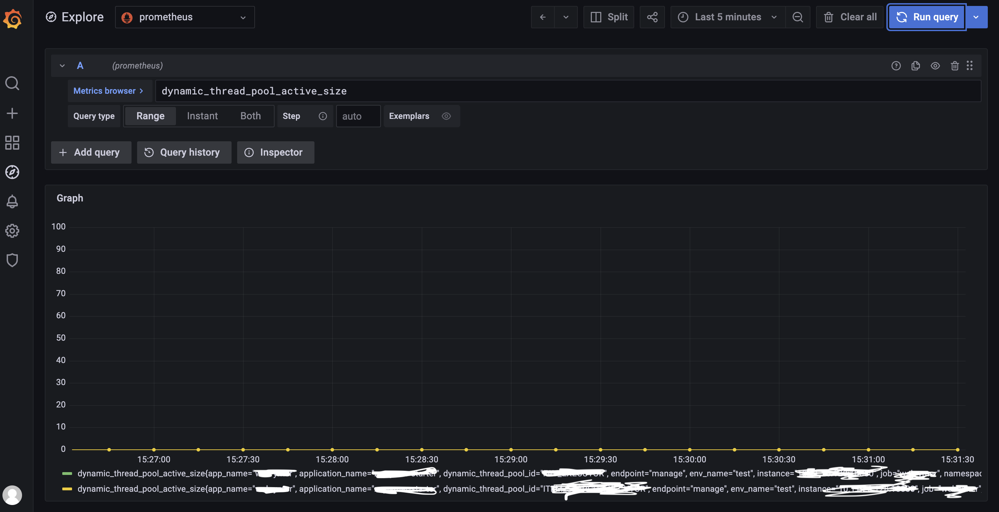

## 背景

> 1.由于业务原因，需要将grafana升级到最新版本，并且将原来的监控大盘也完整的迁移过去
> 2.grafana升级是顺利的（7.3.x-->8.2.0）
> 3.grafana升级后，有些panel显示不正常（time series类型的面板啥都不显示）
> 4.手动执行query inspector不能正常显示数据，一直处于加载状态

## 现象

> 1.升级后这个time series类型的面板就啥都不显示（见下图）


> 2.修改面板中的显示类型后，刷新页面，数据又能正常显示（见下图）


> 3.再次修改数据类型为time series后，刷新页面，面板再次啥都不显示（图略）

## 排查
**1.查看查询语句是否有报错**

> a.使用exploer进入查询界面，数据类型调整为time series后执行run query，发现能够正常显示数据，说明指标数据是有的。



**2.修改各种面板配置**
> a.尝试调整各个配置：时区，time range，以及其他的面板配置，发现都不起作用，仍然啥都不显示
> b.查看dashboard变量，也没有啥问题
> c.重新建一个panel，然后将刚才的查询语句复制进去，数据类型选择为time series，仍然啥都不显示
> 至此，说明了一个问题，面板配置基本上是没啥问题的，那么最可能出问题的点应该是整个dashboard的基本配置与老版本不兼容，于是继续下一步

**3.修改dashboard的json model**

> a.查看全局pulgin里面，time series的版本是`5.0.0`，但是这个dashboard的json配置上，每个panel里面都包含了这个配置`"pluginVersion": "8.2.0"`，我认为这个可能是个问题点，因此把这个配置的值修改为`5.0.0`，保存后再刷新，仍然不起任何作用。
>

> b.这时想到：一个个配置去修改，还不如直接去生成一个新的dashboard看一下能不能兼容，于是新生成了个dashboard，然后将查询语句填入，数据类型修改为time series，发现可以正常显示图形了，那么剩下的就是对比这个新的dashboard和原来的dashboard的json配置即可了
> c.经核对，发现老的dashboard里面有一个配置与新的差异较大

```yaml
# 老的dashboard配置
...
"datasource": {
    "type": "datasource",
    "uid": "grafana"
},
...

# 新dashboard的配置
...
"datasource": "-- Grafana --",
...
```

## 解决

**修改json model配置**

> 将老的dashboard中的datasource配置的值修改为`"-- Grafana --"`
> 保存后刷新页面，发现time series类型的panel可以正常显示
> 至此，这个问题已被解决。
